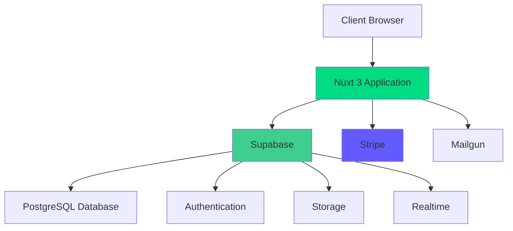

# Studio Scheduler

A comprehensive dance studio management application built with Nuxt 3, featuring class scheduling, recital management, ticketing with interactive seat selection, and Stripe payment integration.

[](https://opensource.org/licenses/MIT)
[](https://nodejs.org/)
[](https://nuxt.com/)

## Features

### Class Management
- Create and manage class definitions (Ballet, Jazz, Contemporary, etc.)
- Set class levels, age groups, and prerequisites
- Assign teachers to classes
- Build weekly schedules with visual calendar
- Track student enrollments

### Recital Management
- Create multi-show recital events
- Drag-and-drop program builder
- Generate professional PDF programs
- Manage cast lists and costume assignments
- Backstage scheduling

### Ticketing System
- Interactive seating chart with real-time availability
- Consecutive seat detection
- Multi-show ticket purchases
- QR code ticket generation
- Email ticket delivery
- Day-of-show check-in and scanning

### Attendance Tracking
- Manual and QR code check-in
- Automatic late detection
- Parent notifications
- Attendance reports and analytics

### Payment Processing
- Stripe integration for secure payments
- Support for one-time and recurring payments
- Automatic invoice generation
- Refund management

### Role-Based Access Control
- 5 user roles: Admin, Staff, Teacher, Parent, Student
- 30+ granular permissions
- Secure route protection
- Role-specific dashboards

### Progressive Web App (PWA)
- Installable on mobile devices
- Offline functionality
- Background sync
- Push notifications (future)

## Tech Stack

- **Framework**: [Nuxt 3](https://nuxt.com/) (Vue 3, TypeScript)
- **Database/Auth**: [Supabase](https://supabase.com/) (PostgreSQL)
- **UI Components**: [PrimeVue 4](https://primevue.org/) (unstyled with Tailwind)
- **Styling**: [Tailwind CSS](https://tailwindcss.com/)
- **State Management**: [Pinia](https://pinia.vuejs.org/)
- **Payments**: [Stripe](https://stripe.com/)
- **Email**: [Mailgun](https://www.mailgun.com/)
- **Testing**: [Vitest](https://vitest.dev/), [Playwright](https://playwright.dev/)
- **Calendar**: [FullCalendar](https://fullcalendar.io/)
- **Rich Text**: [TipTap](https://tiptap.dev/)
- **PDF Generation**: jsPDF, pdf-lib, Puppeteer

## Prerequisites

Before you begin, ensure you have the following installed:

- **Node.js** 18.0.0 or higher ([Download](https://nodejs.org/))
- **npm** 9.0.0 or higher (comes with Node.js)
- **Git** ([Download](https://git-scm.com/))

You'll also need accounts for:

- **Supabase** ([Sign up](https://app.supabase.com/)) - Database and authentication
- **Stripe** ([Sign up](https://dashboard.stripe.com/register)) - Payment processing
- **Mailgun** ([Sign up](https://signup.mailgun.com/)) - Email delivery

## Quick Start

### 1. Clone the Repository

```bash
git clone https://github.com/your-org/studio-scheduler.git
cd studio-scheduler
```

### 2. Install Dependencies

```bash
npm install
```

### 3. Set Up Environment Variables

Create a `.env` file in the root directory:

```bash
cp .env.example .env
```

Edit `.env` with your credentials:

```bash
# Supabase
SUPABASE_URL=https://your-project.supabase.co
SUPABASE_ANON_KEY=your-anon-key-here
SUPABASE_SERVICE_KEY=your-service-role-key-here

# Stripe (use test keys for development)
STRIPE_PUBLISHABLE_KEY=pk_test_your-key-here
STRIPE_SECRET_KEY=sk_test_your-key-here

# Mailgun
MAILGUN_API_KEY=your-mailgun-api-key-here
MAILGUN_DOMAIN=mg.yourdomain.com

# Application URL
MARKETING_SITE_URL=http://localhost:3000
```

### 4. Set Up Supabase Database

1. Go to your [Supabase Dashboard](https://app.supabase.com/)
2. Create a new project
3. Navigate to the SQL Editor
4. Run the migration scripts from `/supabase/migrations/` (in order)
5. Verify tables are created in the Table Editor

### 5. Run Development Server

```bash
npm run dev
```

Visit [http://localhost:3000](http://localhost:3000) to see the application.

### 6. Create Your First Admin User

1. Navigate to [http://localhost:3000/auth/register](http://localhost:3000/auth/register)
2. Create an account
3. In Supabase SQL Editor, update the user role:

```sql
UPDATE profiles
SET user_role = 'admin'
WHERE email = 'your-email@example.com';
```

4. Refresh the page and you'll have admin access

## Development

### Available Scripts

```bash
# Start development server (http://localhost:3000)
npm run dev

# Build for production
npm run build

# Preview production build
npm run preview

# Run tests
npm test

# Run tests with coverage
npm run test:coverage

# Run tests in watch mode
npm test -- --watch

# Lint code
npm run lint

# Format code
npm run format
```

### Project Structure

```
studio-scheduler/
├── components/          # Vue components (auto-imported)
│   ├── AppHeader.vue
│   ├── AppSidebar.vue
│   ├── recital-program/ # Feature-specific components
│   ├── seating/
│   └── ticket/
├── composables/         # Vue composables (auto-imported)
│   ├── useApiService.ts
│   ├── usePermissions.ts
│   └── useTicketingService.ts
├── docs/                # Documentation
│   ├── architecture.md
│   ├── deployment.md
│   ├── testing.md
│   └── workflows/
├── layouts/             # Page layouts
│   ├── default.vue
│   └── auth.vue
├── middleware/          # Route guards
│   ├── auth.ts
│   ├── admin.ts
│   └── staff.ts
├── pages/               # File-based routing
│   ├── index.vue
│   ├── classes/
│   ├── recitals/
│   ├── schedules/
│   └── public/
├── server/              # Server-side code
│   ├── api/            # API endpoints
│   └── utils/
├── stores/              # Pinia stores
│   ├── auth.ts
│   ├── studio.ts
│   └── schedule.ts
├── types/               # TypeScript types
│   ├── index.ts
│   ├── auth.ts
│   └── recitals.ts
├── .env.example         # Environment variables template
├── CLAUDE.md            # AI assistant guidance
├── CONTRIBUTING.md      # Contribution guidelines
├── nuxt.config.ts      # Nuxt configuration
└── package.json
```

## Testing

The project uses Vitest for unit and integration tests, and Playwright for end-to-end tests.

### Run All Tests

```bash
npm test
```

### Run Specific Tests

```bash
# Unit tests only
npm test -- __tests__/unit

# Integration tests only
npm test -- __tests__/integration

# Specific test file
npm test -- __tests__/unit/composables/usePermissions.spec.ts
```

### Coverage Report

```bash
npm run test:coverage
open coverage/index.html
```

See [Testing Guide](/docs/testing.md) for detailed testing documentation.

## Deployment

The application can be deployed to various platforms:

### Vercel (Recommended)

[](https://vercel.com/new/clone?repository-url=https://github.com/your-org/studio-scheduler)

1. Push your code to GitHub
2. Import project in [Vercel](https://vercel.com)
3. Add environment variables
4. Deploy

### Netlify

1. Push your code to GitHub
2. Import project in [Netlify](https://netlify.com)
3. Build command: `npm run build`
4. Publish directory: `.output/public`
5. Add environment variables
6. Deploy

### Self-Hosted

```bash
# Build the application
npm run build

# Start the production server
node .output/server/index.mjs
```

See [Deployment Guide](/docs/deployment.md) for detailed deployment instructions.

## Documentation

- **[Architecture Guide](/docs/architecture.md)** - System architecture and design patterns
- **[Deployment Guide](/docs/deployment.md)** - Production deployment instructions
- **[Testing Guide](/docs/testing.md)** - Testing philosophy and best practices
- **[Contributing Guide](/CONTRIBUTING.md)** - How to contribute to the project
- **[CLAUDE.md](/CLAUDE.md)** - AI assistant guidance for development

### Workflow Guides

- **[Ticketing Workflow](/docs/workflows/ticketing.md)** - Complete ticket purchase flow
- **[Attendance Workflow](/docs/workflows/attendance.md)** - Student check-in/check-out
- **[Payment Workflow](/docs/workflows/payments.md)** - Stripe payment processing
- **[Recital Workflow](/docs/workflows/recitals.md)** - Recital management from creation to show day

### Feature Guides

- **[RBAC Guide](/docs/rbac-guide.md)** - Role-based access control
- **[PWA Guide](/docs/pwa-guide.md)** - Progressive web app features
- **[Email System](/docs/email-notification-system.md)** - Email notifications
- **[Parent Portal](/docs/parent-portal-guide.md)** - Parent-facing features

## Architecture Overview



See [Architecture Guide](/docs/architecture.md) for detailed architecture documentation.

## Key Features in Detail

### Recital Program Builder

Build professional recital programs with drag-and-drop:

- Reorder performances by dragging
- Add intermissions and advertisements
- Set performance details (song, costume, etc.)
- Generate PDF programs
- Auto-generate cast lists

### Interactive Seating Chart

Visual seat selection with real-time updates:

- Color-coded seat status (available, reserved, sold)
- Consecutive seat detection
- Multiple seating sections
- Real-time availability via WebSockets
- Price tier highlighting

### QR Code Ticketing

Modern digital ticketing:

- Unique QR code per ticket
- Email delivery with PDF attachments
- Mobile-optimized display
- Fast check-in scanning
- Duplicate entry prevention

### Role-Based Permissions

Granular access control:

| Role | Permissions |
|------|------------|
| **Admin** | Full access to all features |
| **Staff** | Day-to-day operations (attendance, check-in) |
| **Teacher** | Manage own classes and availability |
| **Parent** | View children, purchase tickets, manage account |
| **Student** | View own schedule and info |

## Browser Support

- Chrome (latest)
- Firefox (latest)
- Safari (latest)
- Edge (latest)
- Mobile browsers (iOS Safari, Chrome)

## Performance

- Lighthouse Score: 95+
- First Contentful Paint: < 1.5s
- Time to Interactive: < 3s
- Fully accessible (WCAG 2.1 AA)

## Security

- Row-Level Security (RLS) on all database tables
- CSRF protection via Nuxt Security module
- Secure authentication with Supabase Auth
- PCI DSS compliant payment processing (Stripe)
- Environment variable protection
- Input validation and sanitization

## Contributing

We welcome contributions! Please see our [Contributing Guide](/CONTRIBUTING.md) for details.

### Quick Contribution Steps

1. Fork the repository
2. Create a feature branch (`git checkout -b feature/amazing-feature`)
3. Commit your changes (`git commit -m 'feat: add amazing feature'`)
4. Push to the branch (`git push origin feature/amazing-feature`)
5. Open a Pull Request

## License

This project is licensed under the MIT License - see the [LICENSE](LICENSE) file for details.

## Support

- **Documentation**: Check the [docs](/docs) folder
- **Issues**: [GitHub Issues](https://github.com/your-org/studio-scheduler/issues)
- **Discussions**: [GitHub Discussions](https://github.com/your-org/studio-scheduler/discussions)

## Acknowledgments

Built with amazing open-source technologies:

- [Nuxt 3](https://nuxt.com/) - The Intuitive Vue Framework
- [Supabase](https://supabase.com/) - Open Source Firebase Alternative
- [PrimeVue](https://primevue.org/) - Rich UI Component Library
- [Stripe](https://stripe.com/) - Online Payment Processing
- [Tailwind CSS](https://tailwindcss.com/) - Utility-First CSS Framework

## Roadmap

Future features planned:

- [ ] Mobile app (React Native)
- [ ] Multi-tenant support
- [ ] Advanced reporting and analytics
- [ ] Automated email campaigns
- [ ] SMS notifications
- [ ] Payment plans and installments
- [ ] Merchandise sales
- [ ] Photo gallery integration
- [ ] Video streaming for classes
- [ ] AI-powered schedule optimization

## Screenshots

### Dashboard


### Seating Chart


### Program Builder


---

**Made with ❤️ for dance studios everywhere**
