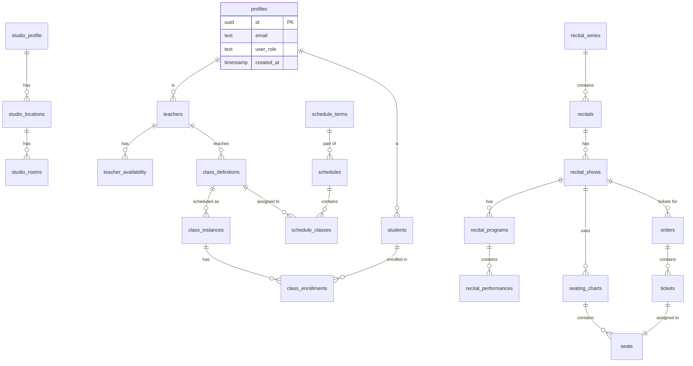

# System Architecture

## Overview

The Studio Scheduler is a full-stack web application built with modern technologies for managing dance studio operations. It follows a three-tier architecture with clear separation of concerns.

## Architecture Diagram


## Technology Stack

### Frontend
- **Framework**: Nuxt 3 (Vue 3, TypeScript)
  - File-based routing
  - Auto-imports for components/composables
  - Server-side rendering (SSR) support
  - Progressive Web App (PWA) capabilities

- **UI Library**: PrimeVue 4
  - Unstyled components
  - Custom Tailwind theme via `tailwindcss-primeui`
  - Comprehensive component suite (DataTable, Calendar, Dialog, etc.)

- **State Management**: Pinia
  - Type-safe stores
  - DevTools integration
  - Modular store design

- **Styling**: Tailwind CSS
  - Utility-first CSS
  - Custom design system
  - PrimeUI preset for component theming

- **Forms**: VeeValidate + Yup/Zod
  - Schema-based validation
  - Form state management
  - Error handling

### Backend
- **Database**: Supabase (PostgreSQL)
  - Row-Level Security (RLS)
  - Real-time subscriptions
  - Auto-generated REST API
  - Built-in authentication

- **Authentication**: Supabase Auth
  - Email/password authentication
  - Role-based access control (RBAC)
  - Session management
  - Magic link support

- **Storage**: Supabase Storage
  - File uploads (logos, images)
  - Access control via RLS
  - CDN delivery

- **Real-time**: Supabase Realtime
  - WebSocket connections
  - Database change subscriptions
  - Broadcast messaging

### External Services
- **Payments**: Stripe
  - Checkout sessions
  - Payment intents
  - Webhook handling
  - Test mode for development

- **Email**: Mailgun
  - Transactional emails
  - Email templates (MJML)
  - Delivery tracking

### Additional Libraries
- **Calendar**: FullCalendar
- **Rich Text**: TipTap
- **PDF Generation**: jsPDF, pdf-lib, puppeteer
- **QR Codes**: qrcode
- **Testing**: Vitest, @nuxt/test-utils, Playwright

## Project Structure

```
studio-scheduler/
├── .nuxt/                    # Generated Nuxt files (gitignored)
├── components/               # Vue components (auto-imported)
│   ├── AppHeader.vue
│   ├── AppSidebar.vue
│   ├── recital-program/     # Feature-specific components
│   ├── seating/
│   └── ticket/
├── composables/             # Vue composables (auto-imported)
│   ├── useApiService.ts
│   ├── usePermissions.ts
│   ├── useStripeService.ts
│   └── useTicketingService.ts
├── layouts/                 # Page layouts
│   ├── default.vue
│   └── auth.vue
├── middleware/              # Route guards
│   ├── auth.ts
│   ├── admin.ts
│   ├── staff.ts
│   └── teacher.ts
├── pages/                   # File-based routing
│   ├── index.vue
│   ├── classes/
│   ├── recitals/
│   ├── schedules/
│   ├── studio/
│   └── public/
├── server/                  # Server-side code
│   ├── api/                # API endpoints
│   │   ├── profile.post.ts
│   │   ├── tickets/
│   │   └── stripe/
│   └── utils/
│       └── supabase.ts
├── stores/                  # Pinia stores
│   ├── auth.ts
│   ├── studio.ts
│   └── schedule.ts
├── types/                   # TypeScript types
│   ├── index.ts
│   ├── auth.ts
│   ├── recitals.ts
│   └── studio.ts
├── public/                  # Static assets
├── docs/                    # Documentation
├── nuxt.config.ts          # Nuxt configuration
├── tailwind.config.js      # Tailwind configuration
└── package.json
```

## Database Schema

### Core Tables



### Key Relationships

**Authentication & Authorization**:
- `profiles` table extends Supabase Auth users
- User roles: admin, staff, teacher, parent, student
- Role-based permissions control access to features

**Studio Management**:
- One `studio_profile` per installation
- Multiple `studio_locations` with rooms
- Operating hours per location

**Class Scheduling**:
- `class_definitions` are templates (e.g., "Ballet Level 2")
- `class_instances` are actual occurrences (e.g., "Monday 3pm")
- `schedules` group classes into terms/seasons
- `schedule_classes` links classes to schedules

**Recitals & Ticketing**:
- `recital_series` → `recitals` → `recital_shows`
- Each show has a `seating_chart` with `seats`
- `orders` contain `tickets` assigned to seats
- QR codes generated for ticket validation

## Key Design Patterns

### API Endpoints

RESTful API routes following Nuxt conventions:

```typescript
// server/api/[resource]/[action].[method].ts

// Example: server/api/tickets/purchase.post.ts
export default defineEventHandler(async (event) => {
  const client = getSupabaseClient()
  const body = await readBody(event)

  // 1. Validate input
  // 2. Check permissions
  // 3. Query database
  // 4. Return response

  return { success: true, data: result }
})
```

### Composables Service Pattern

Centralized API client methods:

```typescript
// composables/useTicketingService.ts
export function useTicketingService() {
  const purchaseTickets = async (orderData: OrderData) => {
    const { data, error } = await useFetch('/api/tickets/purchase', {
      method: 'POST',
      body: orderData
    })
    return { data, error }
  }

  return { purchaseTickets }
}
```

### State Management

Pinia stores for reactive state:

```typescript
// stores/auth.ts
export const useAuthStore = defineStore('auth', () => {
  const user = ref<User | null>(null)
  const profile = ref<UserProfile | null>(null)

  const isAdmin = computed(() => profile.value?.user_role === 'admin')

  return { user, profile, isAdmin }
})
```

### Route Protection

Middleware for role-based access control:

```vue
<!-- pages/admin/settings.vue -->
<script setup>
definePageMeta({
  middleware: 'admin'  // Requires admin role
})
</script>
```

## Authentication Flow


## Payment Flow (Stripe)


## Real-time Features

The application uses Supabase Realtime for live updates:

- **Seat Availability**: Real-time seat status during ticket purchase
- **Order Status**: Live order updates during checkout
- **Class Enrollments**: Instant enrollment updates
- **Teacher Availability**: Real-time availability changes

```typescript
// Example: Real-time seat updates
const channel = supabase
  .channel('seats-changes')
  .on('postgres_changes', {
    event: '*',
    schema: 'public',
    table: 'seats',
    filter: `seating_chart_id=eq.${chartId}`
  }, (payload) => {
    // Update local seat state
    updateSeatStatus(payload.new)
  })
  .subscribe()
```

## Progressive Web App (PWA)

The application is a fully-featured PWA with:

- **Offline Support**: Service worker caching for offline access
- **Installable**: Add to home screen on mobile devices
- **Background Sync**: Queue actions when offline, sync when online
- **Push Notifications**: (Future) Notify users of events
- **Auto-updates**: Automatic service worker updates

See [/docs/pwa-guide.md](/docs/pwa-guide.md) for complete PWA documentation.

## Security Considerations

### Row-Level Security (RLS)

All database tables use Supabase RLS policies:

- Users can only see their own data
- Admin role can access all data
- Teachers can see their own classes
- Parents can see their children's data

### API Security

- All sensitive operations require authentication
- Role-based permission checks on API routes
- Input validation using Yup/Zod schemas
- CSRF protection via Nuxt Security module

### Payment Security

- PCI compliance through Stripe
- No credit card data stored locally
- Webhook signature verification
- Test mode for development

## Performance Optimizations

- **Code Splitting**: Automatic route-based splitting
- **Lazy Loading**: Components loaded on-demand
- **Image Optimization**: Nuxt Image for optimized images
- **Database Indexing**: Optimized queries with indexes
- **Caching**: Service worker caching for static assets
- **SSR**: Server-side rendering for faster initial load

## Scalability Considerations

### Current Architecture (Single-tenant)

- One studio profile per installation
- Supabase handles scaling up to 10k+ concurrent users
- Horizontal scaling via Nuxt deployment options

### Future Multi-tenant Architecture

See [/docs/tier1/multi-tenant-architecture.md](/docs/tier1/multi-tenant-architecture.md) for plans to support multiple studios in a single installation.

## Related Documentation

- [Deployment Guide](/docs/deployment.md)
- [Testing Guide](/docs/testing.md)
- [RBAC Guide](/docs/rbac-guide.md)
- [PWA Guide](/docs/pwa-guide.md)
- [Database Schema](/docs/database/recital-program-db.md)
- [Email System](/docs/email-notification-system.md)
