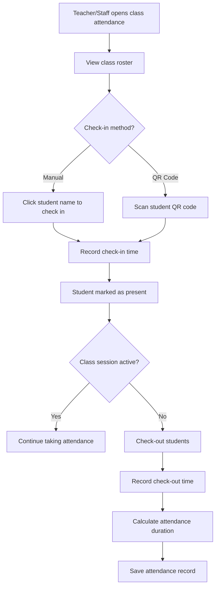

# Attendance Workflow

## Overview

The attendance system allows teachers and staff to track student attendance for classes, including check-in, check-out, and absence tracking. The system supports both manual check-in and QR code scanning.

## User Flow



## Attendance States

### Check-in States

- **Not Present**: Student not checked in (default)
- **Present**: Student checked in
- **Late**: Student checked in after grace period
- **Excused Absence**: Parent/guardian notified in advance
- **Unexcused Absence**: Student did not attend

### Check-out States

- **Still Present**: Student has not checked out
- **Checked Out**: Student checked out normally
- **Early Departure**: Student left before class ended

## Step-by-Step Process

### 1. Open Class Attendance

**Page**: `/classes/[id]/attendance`

**Who can access**: Teachers, Staff, Admin

**What happens**:
- System loads class definition and schedule
- Retrieves current enrolled students
- Shows today's attendance status
- Displays historical attendance data

**Code flow**:
```typescript
// pages/classes/[id]/attendance.vue
const { data: classInfo } = await useAsyncData('class', () =>
  $fetch(`/api/classes/${route.params.id}`)
)

const { data: enrollments } = await useAsyncData('enrollments', () =>
  $fetch(`/api/enrollments/list`, {
    query: { class_id: route.params.id }
  })
)

const { data: attendanceRecords } = await useAsyncData('attendance', () =>
  $fetch(`/api/attendance/list`, {
    query: {
      class_id: route.params.id,
      date: today
    }
  })
)
```

### 2. Manual Check-In

**Component**: `AttendanceRoster.vue`

**Process**:
1. Teacher clicks student name or photo
2. System records check-in time
3. Calculates if late (> 5 minutes after class start)
4. Updates UI with check-in status

**Code flow**:
```typescript
// components/attendance/AttendanceRoster.vue
const checkIn = async (studentId: string) => {
  const now = new Date()
  const classStartTime = new Date(classInfo.value.start_time)

  // Check if late
  const minutesLate = (now.getTime() - classStartTime.getTime()) / 60000
  const status = minutesLate > 5 ? 'late' : 'present'

  await $fetch('/api/attendance/check-in', {
    method: 'POST',
    body: {
      student_id: studentId,
      class_instance_id: classInstanceId,
      check_in_time: now.toISOString(),
      status
    }
  })

  // Update local state
  attendanceMap.value[studentId] = {
    status,
    check_in_time: now,
    minutes_late: minutesLate > 5 ? Math.round(minutesLate) : 0
  }
}
```

### 3. QR Code Check-In

**Component**: `QRScanner.vue`

**Process**:
1. Teacher clicks "Scan QR Code" button
2. Camera activates
3. Student presents QR code (from parent portal or ID card)
4. System decodes QR data
5. Validates student is enrolled in class
6. Records check-in automatically

**QR Code Data**:
```json
{
  "student_id": "uuid",
  "name": "John Doe",
  "validation_code": "ABC123",
  "expiry": "2025-12-31"
}
```

**Code flow**:
```typescript
// components/attendance/QRScanner.vue
import jsQR from 'jsqr'

const onQRCodeScanned = async (qrData: string) => {
  try {
    const data = JSON.parse(qrData)

    // Validate student enrollment
    const enrollment = enrollments.value.find(
      e => e.student_id === data.student_id
    )

    if (!enrollment) {
      showError('Student not enrolled in this class')
      return
    }

    // Check in student
    await checkIn(data.student_id)
    showSuccess(`${data.name} checked in successfully`)

  } catch (error) {
    showError('Invalid QR code')
  }
}
```

### 4. Mark Absences

**Process**:
- If student not checked in by class end
- Teacher manually marks as absent
- Can specify excused vs. unexcused
- Optional notes field

**Code flow**:
```typescript
const markAbsent = async (studentId: string, excused: boolean, notes?: string) => {
  await $fetch('/api/attendance/absent', {
    method: 'POST',
    body: {
      student_id: studentId,
      class_instance_id: classInstanceId,
      date: today,
      excused,
      notes
    }
  })
}
```

### 5. Check-Out

**Process**:
1. At end of class or when student leaves early
2. Teacher marks student as checked out
3. System records check-out time
4. Calculates total attendance duration

**Code flow**:
```typescript
const checkOut = async (studentId: string) => {
  const now = new Date()

  await $fetch('/api/attendance/check-out', {
    method: 'POST',
    body: {
      student_id: studentId,
      class_instance_id: classInstanceId,
      check_out_time: now.toISOString()
    }
  })

  // Calculate duration
  const checkIn = attendanceMap.value[studentId].check_in_time
  const duration = (now.getTime() - checkIn.getTime()) / 60000 // minutes

  attendanceMap.value[studentId].check_out_time = now
  attendanceMap.value[studentId].duration = Math.round(duration)
}
```

### 6. Bulk Operations

**Features**:
- Check in all students at once
- Check out all students at once
- Mark remaining students as absent

**Code flow**:
```typescript
const checkInAll = async () => {
  const uncheckedStudents = enrollments.value.filter(
    e => !attendanceMap.value[e.student_id]
  )

  await Promise.all(
    uncheckedStudents.map(student => checkIn(student.student_id))
  )
}

const checkOutAll = async () => {
  const checkedInStudents = Object.entries(attendanceMap.value)
    .filter(([_, data]) => !data.check_out_time)
    .map(([studentId]) => studentId)

  await Promise.all(
    checkedInStudents.map(studentId => checkOut(studentId))
  )
}
```

## Database Schema

### attendance_records Table

```sql
CREATE TABLE attendance_records (
  id UUID PRIMARY KEY DEFAULT uuid_generate_v4(),
  student_id UUID REFERENCES students(id) NOT NULL,
  class_instance_id UUID REFERENCES class_instances(id) NOT NULL,
  date DATE NOT NULL,
  check_in_time TIMESTAMPTZ,
  check_out_time TIMESTAMPTZ,
  status VARCHAR(20) NOT NULL, -- 'present', 'late', 'absent', 'excused'
  minutes_late INTEGER DEFAULT 0,
  notes TEXT,
  created_at TIMESTAMPTZ DEFAULT NOW(),
  updated_at TIMESTAMPTZ DEFAULT NOW(),

  UNIQUE(student_id, class_instance_id, date)
)
```

## Parent Portal Integration

### Absence Notifications

Parents receive notifications when their child is marked absent:

**Email template**:
```
Subject: [Student Name] marked absent from [Class Name]

Hi [Parent Name],

Your child [Student Name] was marked absent from [Class Name] on [Date].

If this was excused, please contact us to update the record.

Class: [Class Name]
Date: [Date]
Time: [Time]
Teacher: [Teacher Name]
```

### Attendance History

Parents can view their child's attendance history:

**Page**: `/parent/students/[id]/attendance`

- Calendar view with color-coded attendance
- Attendance percentage
- Late arrivals
- Excused vs. unexcused absences

## Teacher Reports

### Class Attendance Summary

**Page**: `/classes/[id]/reports/attendance`

**Metrics**:
- Overall attendance rate
- Students with perfect attendance
- Students with concerning attendance patterns
- Late arrival trends

**Code flow**:
```typescript
const calculateAttendanceRate = (studentId: string) => {
  const records = attendanceRecords.value.filter(r => r.student_id === studentId)
  const totalClasses = classInstances.value.length
  const presentCount = records.filter(r =>
    ['present', 'late'].includes(r.status)
  ).length

  return (presentCount / totalClasses) * 100
}
```

### Individual Student Report

**Metrics for each student**:
- Attendance percentage
- Total absences (excused/unexcused)
- Late arrivals
- Average check-in time
- Attendance trend (improving/declining)

## Real-time Features

### Live Attendance Updates

Multiple staff members can take attendance simultaneously:

```typescript
// Real-time subscription
const channel = supabase
  .channel('attendance-changes')
  .on('postgres_changes', {
    event: '*',
    schema: 'public',
    table: 'attendance_records',
    filter: `class_instance_id=eq.${classInstanceId}`
  }, (payload) => {
    updateAttendanceInUI(payload.new)
  })
  .subscribe()
```

### Parent Notifications

Parents receive real-time check-in notifications (optional feature):

**SMS/Push notification**:
```
[Student Name] checked in to [Class Name] at [Time]
```

## Attendance Policies

### Late Policy

Configurable per studio:
- Grace period (default: 5 minutes)
- Marked as late after grace period
- Excessive tardiness may affect enrollment

### Absence Policy

- **Excused**: Illness, family emergency, pre-approved
- **Unexcused**: No notification given
- Excessive absences may require makeup classes

### Makeup Classes

If student misses class:
- Parent can request makeup class
- Staff schedules student into different class section
- Tracks makeup class attendance separately

## Administrative Features

### Attendance Audit

**Page**: `/admin/attendance/audit`

**Features**:
- View all attendance records
- Search by student, teacher, class
- Export to CSV
- Identify data issues (missing check-outs, etc.)

### Attendance Corrections

Staff can correct attendance mistakes:

**Process**:
1. Navigate to attendance record
2. Click "Edit"
3. Update check-in/out times or status
4. Add correction note
5. Save changes

**Audit trail**:
```sql
CREATE TABLE attendance_corrections (
  id UUID PRIMARY KEY DEFAULT uuid_generate_v4(),
  attendance_record_id UUID REFERENCES attendance_records(id),
  corrected_by UUID REFERENCES profiles(id),
  old_values JSONB,
  new_values JSONB,
  reason TEXT,
  corrected_at TIMESTAMPTZ DEFAULT NOW()
)
```

## Integration with Billing

Attendance data can integrate with billing:

- **Usage-based billing**: Charge per class attended
- **Attendance requirements**: Minimum attendance for discounts
- **Makeup class credits**: Track owed makeup classes

## Mobile Optimizations

The attendance interface is optimized for tablets:

- Large touch targets for easy tapping
- Portrait and landscape support
- Offline mode with sync when online
- Quick QR code scanning

## Related Documentation

- [Architecture Guide](/docs/architecture.md)
- [Parent Portal Guide](/docs/parent-portal-guide.md)
- [ATTENDANCE_SYSTEM.md](/docs/ATTENDANCE_SYSTEM.md)
- [PWA Guide](/docs/pwa-guide.md)
