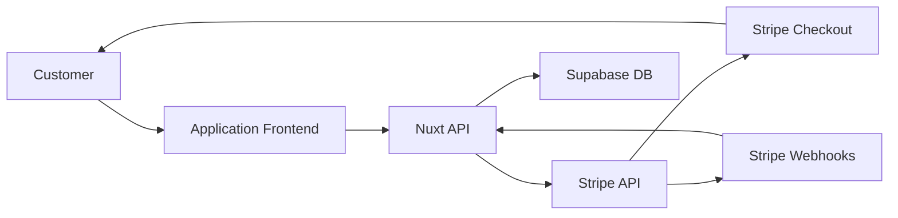

# Payment Processing Workflow

## Overview

The Studio Scheduler uses Stripe for all payment processing, including ticket purchases, class enrollment fees, and recital costume fees. This ensures PCI compliance and secure handling of sensitive payment data.

## Payment Types

### 1. Ticket Purchases (One-time)
- Public-facing checkout
- Immediate payment required
- No refunds (business policy)

### 2. Class Enrollment (Recurring)
- Parent portal checkout
- Monthly or term-based billing
- Prorated for mid-term enrollment

### 3. Recital Fees (One-time)
- Costume fees
- Participation fees
- Optional extras (photos, videos)

## Architecture



## Stripe Checkout Flow

### 1. Create Checkout Session

**Frontend initiates checkout**:

```typescript
// composables/useStripeService.ts
export function useStripeService() {
  const createCheckoutSession = async (items: CheckoutItem[]) => {
    const { data, error } = await useFetch('/api/stripe/create-checkout-session', {
      method: 'POST',
      body: { items }
    })

    if (error.value) {
      throw new Error('Failed to create checkout session')
    }

    // Redirect to Stripe Checkout
    window.location.href = data.value.url
  }

  return { createCheckoutSession }
}
```

**Backend creates Stripe session**:

```typescript
// server/api/stripe/create-checkout-session.post.ts
import Stripe from 'stripe'

export default defineEventHandler(async (event) => {
  const config = useRuntimeConfig()
  const stripe = new Stripe(config.stripeSecretKey)
  const { items, customerInfo, metadata } = await readBody(event)

  // Create Stripe checkout session
  const session = await stripe.checkout.sessions.create({
    mode: 'payment', // or 'subscription' for recurring
    line_items: items.map(item => ({
      price_data: {
        currency: 'usd',
        product_data: {
          name: item.name,
          description: item.description,
          images: item.images || []
        },
        unit_amount: Math.round(item.price * 100) // Convert to cents
      },
      quantity: item.quantity
    })),
    customer_email: customerInfo.email,
    success_url: `${config.public.marketingSiteUrl}/checkout/success?session_id={CHECKOUT_SESSION_ID}`,
    cancel_url: `${config.public.marketingSiteUrl}/checkout/cancel`,
    metadata: {
      order_type: metadata.orderType, // 'ticket', 'enrollment', 'recital_fee'
      ...metadata
    }
  })

  return { url: session.url }
})
```

### 2. Customer Completes Payment

**What happens**:
1. Customer redirected to Stripe-hosted checkout page
2. Enters payment information (credit card, Apple Pay, etc.)
3. Stripe validates and processes payment
4. Customer redirected to success or cancel URL

**Security benefits**:
- No credit card data touches our servers (PCI DSS compliance)
- Stripe handles fraud detection
- 3D Secure authentication when required
- Secure data transmission (TLS 1.2+)

### 3. Webhook Processing

**Stripe sends webhook on payment success**:

```typescript
// server/api/stripe/webhook.post.ts
import Stripe from 'stripe'

export default defineEventHandler(async (event) => {
  const config = useRuntimeConfig()
  const stripe = new Stripe(config.stripeSecretKey)

  // Get raw body and signature
  const body = await readRawBody(event)
  const signature = getHeader(event, 'stripe-signature')

  let stripeEvent: Stripe.Event

  try {
    // Verify webhook signature (security)
    stripeEvent = stripe.webhooks.constructEvent(
      body,
      signature,
      config.stripeWebhookSecret
    )
  } catch (err) {
    console.error('Webhook signature verification failed:', err.message)
    throw createError({
      statusCode: 400,
      message: 'Invalid signature'
    })
  }

  // Handle different event types
  switch (stripeEvent.type) {
    case 'checkout.session.completed':
      await handleCheckoutCompleted(stripeEvent.data.object)
      break

    case 'payment_intent.succeeded':
      await handlePaymentSucceeded(stripeEvent.data.object)
      break

    case 'payment_intent.payment_failed':
      await handlePaymentFailed(stripeEvent.data.object)
      break

    default:
      console.log(`Unhandled event type: ${stripeEvent.type}`)
  }

  return { received: true }
})
```

### 4. Order Fulfillment

**Process based on order type**:

```typescript
// server/utils/stripe.ts
async function handleCheckoutCompleted(session: Stripe.Checkout.Session) {
  const supabase = getSupabaseClient()
  const { metadata } = session

  switch (metadata.order_type) {
    case 'ticket':
      // Create order and tickets
      await createTicketOrder(session)
      break

    case 'enrollment':
      // Enroll student in classes
      await enrollStudent(session)
      break

    case 'recital_fee':
      // Record recital fee payment
      await recordRecitalFee(session)
      break
  }
}

async function createTicketOrder(session: Stripe.Checkout.Session) {
  const supabase = getSupabaseClient()
  const { metadata } = session

  // 1. Create order record
  const { data: order, error: orderError } = await supabase
    .from('orders')
    .insert({
      email: session.customer_email,
      total: session.amount_total / 100,
      stripe_session_id: session.id,
      stripe_payment_intent_id: session.payment_intent,
      show_id: metadata.show_id,
      status: 'completed'
    })
    .select()
    .single()

  if (orderError) throw orderError

  // 2. Create tickets
  const seatIds = metadata.seat_ids.split(',')
  const tickets = await Promise.all(
    seatIds.map(seatId =>
      supabase.from('tickets').insert({
        order_id: order.id,
        seat_id: seatId,
        price: parseFloat(metadata.ticket_price),
        qr_code: await generateQRCode(order.id, seatId)
      })
    )
  )

  // 3. Update seats to sold
  await supabase
    .from('seats')
    .update({ status: 'sold', reserved_until: null })
    .in('id', seatIds)

  // 4. Send confirmation email
  await sendTicketConfirmationEmail(order, tickets)
}
```

## Payment Intent Flow (Advanced)

For more control, use Payment Intents instead of Checkout Sessions:

```typescript
// Create Payment Intent
const paymentIntent = await stripe.paymentIntents.create({
  amount: 5000, // $50.00 in cents
  currency: 'usd',
  payment_method_types: ['card'],
  metadata: {
    order_type: 'enrollment',
    student_id: 'student-123'
  }
})

// Return client secret to frontend
return { clientSecret: paymentIntent.client_secret }
```

**Frontend completes payment**:

```typescript
import { loadStripe } from '@stripe/stripe-js'

const stripe = await loadStripe(config.public.stripePublishableKey)

const { error } = await stripe.confirmCardPayment(clientSecret, {
  payment_method: {
    card: cardElement,
    billing_details: {
      name: 'Customer Name',
      email: 'customer@example.com'
    }
  }
})

if (error) {
  // Handle error
} else {
  // Payment succeeded
}
```

## Refund Processing

### Full Refund

```typescript
// server/api/stripe/refund.post.ts
export default defineEventHandler(async (event) => {
  const config = useRuntimeConfig()
  const stripe = new Stripe(config.stripeSecretKey)
  const { paymentIntentId, reason } = await readBody(event)

  // Create refund
  const refund = await stripe.refunds.create({
    payment_intent: paymentIntentId,
    reason: reason || 'requested_by_customer'
  })

  // Update order status
  await supabase
    .from('orders')
    .update({ status: 'refunded', refunded_at: new Date() })
    .eq('stripe_payment_intent_id', paymentIntentId)

  return { success: true, refund }
})
```

### Partial Refund

```typescript
const refund = await stripe.refunds.create({
  payment_intent: paymentIntentId,
  amount: 2500, // $25.00 in cents
  reason: 'requested_by_customer'
})
```

## Subscription Billing (Future Feature)

For recurring class enrollment fees:

```typescript
// Create subscription
const subscription = await stripe.subscriptions.create({
  customer: customerId,
  items: [
    {
      price: 'price_monthly_class_fee',
      quantity: 1
    }
  ],
  payment_behavior: 'default_incomplete',
  payment_settings: {
    save_default_payment_method: 'on_subscription'
  },
  expand: ['latest_invoice.payment_intent']
})
```

## Customer Management

### Create Customer

```typescript
const customer = await stripe.customers.create({
  email: 'parent@example.com',
  name: 'John Doe',
  metadata: {
    user_id: 'uuid',
    profile_type: 'parent'
  }
})

// Store customer ID in database
await supabase
  .from('profiles')
  .update({ stripe_customer_id: customer.id })
  .eq('id', userId)
```

### List Payment Methods

```typescript
const paymentMethods = await stripe.paymentMethods.list({
  customer: customerId,
  type: 'card'
})
```

## Payment Methods Supported

- Credit/Debit Cards (Visa, Mastercard, Amex, Discover)
- Apple Pay
- Google Pay
- ACH Direct Debit (US)
- Cash App Pay

## Error Handling

### Common Payment Errors

```typescript
try {
  const session = await createCheckoutSession(items)
} catch (error) {
  if (error.type === 'StripeCardError') {
    // Card was declined
    showError('Your card was declined. Please try a different card.')
  } else if (error.type === 'StripeInvalidRequestError') {
    // Invalid parameters
    showError('Invalid payment request. Please contact support.')
  } else {
    // Generic error
    showError('Payment failed. Please try again.')
  }
}
```

### Webhook Retry Logic

Stripe automatically retries failed webhooks:
- 3 attempts over 3 days
- Exponential backoff
- Must return 200 status code to acknowledge

```typescript
export default defineEventHandler(async (event) => {
  try {
    await handleWebhook(event)
    return { received: true } // 200 status
  } catch (error) {
    console.error('Webhook processing failed:', error)
    // Return 500 to trigger retry
    throw createError({
      statusCode: 500,
      message: 'Webhook processing failed'
    })
  }
})
```

## Security Best Practices

### 1. Webhook Signature Verification

Always verify webhook signatures:

```typescript
const stripeEvent = stripe.webhooks.constructEvent(
  body,
  signature,
  webhookSecret
)
```

### 2. Idempotency

Prevent duplicate order creation:

```typescript
// Check if order already exists
const existingOrder = await supabase
  .from('orders')
  .select()
  .eq('stripe_session_id', sessionId)
  .single()

if (existingOrder) {
  console.log('Order already processed')
  return { received: true }
}

// Create new order
// ...
```

### 3. Amount Validation

Verify amounts match expectations:

```typescript
const expectedAmount = calculateOrderTotal(items)
const actualAmount = session.amount_total / 100

if (Math.abs(expectedAmount - actualAmount) > 0.01) {
  throw new Error('Amount mismatch')
}
```

### 4. Environment Separation

Use test keys in development:

```bash
# Development (.env.development)
STRIPE_PUBLISHABLE_KEY=pk_test_...
STRIPE_SECRET_KEY=sk_test_...

# Production (.env.production)
STRIPE_PUBLISHABLE_KEY=pk_live_...
STRIPE_SECRET_KEY=sk_live_...
```

## Testing

### Test Cards

Stripe provides test cards for different scenarios:

- Success: `4242 4242 4242 4242`
- Decline: `4000 0000 0000 0002`
- 3D Secure: `4000 0027 6000 3184`
- Insufficient funds: `4000 0000 0000 9995`

### Webhook Testing

Test webhooks locally with Stripe CLI:

```bash
# Install Stripe CLI
brew install stripe/stripe-cli/stripe

# Login
stripe login

# Forward webhooks to local server
stripe listen --forward-to localhost:3000/api/stripe/webhook

# Trigger test events
stripe trigger checkout.session.completed
```

## Monitoring and Alerts

### Key Metrics to Monitor

- Payment success rate
- Failed payment reasons
- Refund rate
- Average transaction value
- Webhook processing time

### Stripe Dashboard

Monitor payments in Stripe Dashboard:
- View all transactions
- Search by customer email
- Export data for accounting
- Set up email alerts for failed payments

## Compliance

### PCI DSS

By using Stripe Checkout and Elements:
- No credit card data touches our servers
- Stripe handles PCI compliance
- We maintain SAQ-A compliance level

### Data Retention

- Store only Stripe customer/payment IDs
- Never store full credit card numbers
- Retain transaction records for 7 years (tax compliance)

## Related Documentation

- [Ticketing Workflow](/docs/workflows/ticketing.md)
- [Architecture Guide](/docs/architecture.md)
- [Stripe Documentation](https://stripe.com/docs)
- [Stripe Webhooks Guide](https://stripe.com/docs/webhooks)
