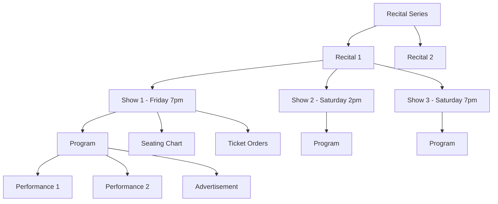

# Recital Management Workflow

## Overview

The recital management system allows studio administrators to create multi-show recitals, build performance programs with drag-and-drop ordering, generate PDF programs, manage seating charts, and sell tickets. This is one of the most complex features in the application.

## Recital Hierarchy



**Terminology**:
- **Recital Series**: Collection of annual recitals (e.g., "2025 Recitals")
- **Recital**: Single recital event (e.g., "Spring Recital 2025")
- **Show**: Specific performance date/time (e.g., "Friday 7pm Show")
- **Program**: Ordered list of performances for a show
- **Performance**: A class dancing in the recital (e.g., "Ballet Level 2 - Swan Lake")

## Complete Workflow

### 1. Create Recital Series

**Page**: `/admin/recitals/series`

**Who can access**: Admin only

**Process**:
1. Admin clicks "Create Recital Series"
2. Enters series name (e.g., "2025 Recitals")
3. Enters description
4. Saves series

**Code flow**:
```typescript
// pages/admin/recitals/series/new.vue
const createSeries = async () => {
  const { data, error } = await $fetch('/api/recital-series/create', {
    method: 'POST',
    body: {
      name: formData.name,
      description: formData.description,
      year: new Date().getFullYear()
    }
  })

  if (!error) {
    navigateTo(`/admin/recitals/series/${data.id}`)
  }
}
```

### 2. Create Recital

**Page**: `/admin/recitals/new`

**Process**:
1. Select recital series
2. Enter recital details:
   - Name (e.g., "Spring Recital")
   - Theme
   - Venue information
   - Date range
3. Upload cover image (optional)
4. Save recital

**Database record**:
```sql
INSERT INTO recitals (
  name,
  series_id,
  theme,
  venue_name,
  venue_address,
  start_date,
  end_date
) VALUES (
  'Spring Recital 2025',
  'series-uuid',
  'Enchanted Garden',
  'Grand Theater',
  '123 Main St',
  '2025-06-01',
  '2025-06-03'
)
```

### 3. Create Shows

**Page**: `/admin/recitals/[id]/shows`

**Process**:
1. Navigate to recital
2. Click "Add Show"
3. For each show, enter:
   - Name (e.g., "Friday Evening Show")
   - Date and time
   - Duration
   - Ticket price tiers
   - Maximum capacity
4. Assign or create seating chart
5. Save show

**Code flow**:
```typescript
// pages/admin/recitals/[id]/shows/new.vue
const createShow = async () => {
  const { data, error } = await $fetch('/api/recital-shows/create', {
    method: 'POST',
    body: {
      recital_id: recitalId,
      name: formData.name,
      date: formData.date,
      time: formData.time,
      duration_minutes: formData.duration,
      venue_name: formData.venue,
      seating_chart_id: selectedSeatingChart.value.id
    }
  })

  if (!error) {
    // Create price tiers
    await createPriceTiers(data.id, formData.priceTiers)
  }
}
```

### 4. Build Program (Drag-and-Drop)

**Page**: `/admin/recitals/[id]/shows/[showId]/program`

**Component**: `RecitalProgramBuilder.vue`

**Process**:
1. Navigate to show program builder
2. Left sidebar shows available classes
3. Drag classes into program order
4. Reorder by dragging within program
5. Add intermission breaks
6. Add advertisements/announcements
7. Set performance details for each:
   - Song/music name
   - Costume description
   - Special notes
8. Auto-save as changes are made

**Code flow**:
```typescript
// components/recital-program/RecitalProgramBuilder.vue
import { useDraggable } from '@vueuse/core'

const programStore = useRecitalProgramStore()

// Drag and drop handlers
const onDragStart = (classId: string, index: number) => {
  draggedItem.value = { classId, index }
}

const onDrop = async (targetIndex: number) => {
  const { classId, index } = draggedItem.value

  // Reorder in store
  programStore.movePerformance(index, targetIndex)

  // Save to database
  await $fetch('/api/recital-programs/reorder', {
    method: 'POST',
    body: {
      program_id: programId,
      performances: programStore.performances.map((p, i) => ({
        id: p.id,
        order: i
      }))
    }
  })
}

// Add class to program
const addClassToProgram = async (classId: string) => {
  const { data } = await $fetch('/api/recital-performances/create', {
    method: 'POST',
    body: {
      program_id: programId,
      class_id: classId,
      order: programStore.performances.length
    }
  })

  programStore.addPerformance(data)
}

// Remove from program
const removeFromProgram = async (performanceId: string) => {
  await $fetch(`/api/recital-performances/${performanceId}`, {
    method: 'DELETE'
  })

  programStore.removePerformance(performanceId)
}
```

### 5. Edit Performance Details

**Component**: `PerformanceDetailsDialog.vue`

**What can be edited**:
- Song/music title
- Costume description
- Props needed
- Special lighting/effects
- Performance notes
- Duration estimate

**Code flow**:
```typescript
const updatePerformance = async (performanceId: string, updates: any) => {
  await $fetch(`/api/recital-performances/${performanceId}`, {
    method: 'PATCH',
    body: updates
  })

  programStore.updatePerformance(performanceId, updates)
}
```

### 6. Add Advertisements/Announcements

**Component**: `AdvertisementDialog.vue`

**Types**:
- Sponsor advertisement
- Thank you message
- Upcoming events
- Program notes

**Process**:
1. Click "Add Advertisement"
2. Select type
3. Enter content (rich text editor)
4. Upload images (optional)
5. Set position in program
6. Save

**Database record**:
```sql
INSERT INTO recital_program_advertisements (
  program_id,
  title,
  content,
  type,
  order_position,
  image_url
) VALUES (
  'program-uuid',
  'Thank You Sponsors',
  '<p>We would like to thank...</p>',
  'sponsor',
  5,
  'https://...'
)
```

### 7. Preview Program

**Page**: `/admin/recitals/[id]/shows/[showId]/program/preview`

**What's shown**:
- Cover page with recital theme
- Welcome message
- Full program in order
- Performance details (song, costume)
- Advertisements at designated positions
- Cast list (students in each class)

**Features**:
- Print-friendly layout
- Export to PDF
- Share preview link

### 8. Generate PDF Program

**Component**: `ProgramPDFGenerator.vue`

**Libraries used**:
- jsPDF (PDF creation)
- pdf-lib (PDF manipulation)
- Puppeteer (HTML to PDF conversion)

**Process**:
```typescript
// composables/useRecitalProgramService.ts
import jsPDF from 'jspdf'
import 'jspdf-autotable'

const generateProgramPDF = async (programId: string) => {
  // Fetch complete program data
  const { data: program } = await $fetch(`/api/recital-programs/${programId}`)

  const doc = new jsPDF()

  // Cover page
  doc.setFontSize(24)
  doc.text(program.recital_name, 105, 50, { align: 'center' })
  doc.setFontSize(18)
  doc.text(program.show_name, 105, 70, { align: 'center' })

  if (program.cover_image) {
    doc.addImage(program.cover_image, 'JPEG', 50, 90, 110, 110)
  }

  // Program pages
  doc.addPage()
  doc.setFontSize(16)
  doc.text('Program', 105, 20, { align: 'center' })

  let yPos = 40
  program.performances.forEach((perf, index) => {
    if (yPos > 270) {
      doc.addPage()
      yPos = 20
    }

    doc.setFontSize(12)
    doc.setFont(undefined, 'bold')
    doc.text(`${index + 1}. ${perf.class_name}`, 20, yPos)

    yPos += 7
    doc.setFont(undefined, 'normal')
    doc.setFontSize(10)
    doc.text(`Song: ${perf.song_title}`, 30, yPos)

    yPos += 5
    doc.text(`Costume: ${perf.costume_description}`, 30, yPos)

    yPos += 10
  })

  // Save PDF
  doc.save(`${program.show_name}-program.pdf`)
}
```

### 9. Set Up Seating Chart

**Page**: `/admin/seating-charts/[id]`

**Options**:

**A. Create from scratch**:
1. Define venue layout (rows, seats per row)
2. Name sections (Orchestra, Balcony, etc.)
3. Set pricing tiers by section
4. Mark obstructed view seats

**B. Import from CSV**:
```csv
section,row,seat_number,price_tier,status
Orchestra,A,1,premium,available
Orchestra,A,2,premium,available
Balcony,AA,1,standard,available
```

**C. Use existing template**:
- Select from venue templates
- Customize for this show

**Code flow**:
```typescript
// Import CSV seating chart
const importSeatingChart = async (file: File) => {
  const formData = new FormData()
  formData.append('file', file)
  formData.append('show_id', showId)

  const { data } = await $fetch('/api/seating-charts/import', {
    method: 'POST',
    body: formData
  })

  return data // { seating_chart_id, seats_created }
}
```

### 10. Publish Recital for Ticket Sales

**Page**: `/admin/recitals/[id]/publish`

**Pre-publish checklist**:
- [ ] All shows created
- [ ] Programs finalized
- [ ] Seating charts configured
- [ ] Ticket prices set
- [ ] Stripe connected
- [ ] Email templates configured

**Process**:
1. Review checklist
2. Set ticket sale start date
3. Generate public ticket URL
4. Click "Publish"
5. Share ticket link with parents/public

**Code flow**:
```typescript
const publishRecital = async () => {
  await $fetch(`/api/recitals/${recitalId}/publish`, {
    method: 'POST',
    body: {
      published: true,
      ticket_sales_start: startDate,
      ticket_sales_end: endDate
    }
  })

  // Get public URL
  const publicUrl = `${config.public.marketingSiteUrl}/public/recital-tickets/${recitalId}`

  // Copy to clipboard
  await navigator.clipboard.writeText(publicUrl)
  showSuccess('Recital published! Link copied to clipboard.')
}
```

### 11. Monitor Ticket Sales

**Page**: `/admin/recitals/[id]/sales`

**Metrics shown**:
- Total tickets sold
- Revenue by show
- Seats remaining
- Popular seating sections
- Sales over time graph

**Real-time updates**:
```typescript
// Real-time ticket sales subscription
const channel = supabase
  .channel('ticket-sales')
  .on('postgres_changes', {
    event: 'INSERT',
    schema: 'public',
    table: 'tickets',
    filter: `show_id=in.(${showIds.join(',')})`
  }, (payload) => {
    // Update sales count
    salesCount.value++
    revenue.value += payload.new.price
  })
  .subscribe()
```

### 12. Manage Orders

**Page**: `/admin/recitals/[id]/orders`

**Features**:
- View all orders
- Search by email or order ID
- Filter by show
- Issue refunds
- Resend confirmation emails
- Export to CSV

### 13. Day-of-Show Management

**Page**: `/admin/recitals/[id]/shows/[showId]/checkin`

**Features**:

**Ticket Scanning**:
- Scan QR codes for entry
- Mark tickets as "checked in"
- Prevent duplicate entry
- Show seat assignment

**Will Call**:
- Lookup orders by email
- Print tickets on-site
- Mark as picked up

**Last-minute Sales**:
- Sell walk-up tickets
- Update seating chart in real-time
- Accept cash/card payments

## Advanced Features

### Multi-Show Cart

**Feature**: Customers can purchase tickets for multiple shows in one transaction.

**Benefits**:
- Families can attend multiple performances
- Higher revenue per transaction
- Better customer experience

**Implementation**:
```typescript
// Add shows to cart
const cartStore = useCartStore()
cartStore.addShow(show1Id, ['A1', 'A2'])
cartStore.addShow(show2Id, ['B1', 'B2'])

// Checkout all at once
const { url } = await createCheckoutSession(cartStore.items)
```

### Cast List Generation

**Feature**: Auto-generate cast lists showing which students perform in each show.

**Page**: `/admin/recitals/[id]/cast-list`

**Output**:
- Organized by class
- Grouped by show
- Export to PDF
- Share with parents

### Costume Tracking

**Feature**: Track costume assignments and inventory.

**Fields**:
- Costume name/description
- Size assignments
- Return status
- Photos

### Backstage Schedule

**Feature**: Show prep/backstage schedule for performers.

**Includes**:
- Call time
- Warmup time
- Performance time
- Costume changes
- Backstage location

## Database Schema

### Key Tables

```sql
-- Recital series (annual collection)
CREATE TABLE recital_series (
  id UUID PRIMARY KEY DEFAULT uuid_generate_v4(),
  name VARCHAR(255) NOT NULL,
  description TEXT,
  year INTEGER,
  created_at TIMESTAMPTZ DEFAULT NOW()
);

-- Individual recitals
CREATE TABLE recitals (
  id UUID PRIMARY KEY DEFAULT uuid_generate_v4(),
  series_id UUID REFERENCES recital_series(id),
  name VARCHAR(255) NOT NULL,
  theme VARCHAR(255),
  venue_name VARCHAR(255),
  venue_address TEXT,
  start_date DATE,
  end_date DATE,
  published BOOLEAN DEFAULT FALSE,
  created_at TIMESTAMPTZ DEFAULT NOW()
);

-- Shows (specific performances)
CREATE TABLE recital_shows (
  id UUID PRIMARY KEY DEFAULT uuid_generate_v4(),
  recital_id UUID REFERENCES recitals(id),
  name VARCHAR(255) NOT NULL,
  date DATE NOT NULL,
  time TIME NOT NULL,
  duration_minutes INTEGER,
  seating_chart_id UUID REFERENCES seating_charts(id),
  created_at TIMESTAMPTZ DEFAULT NOW()
);

-- Programs
CREATE TABLE recital_programs (
  id UUID PRIMARY KEY DEFAULT uuid_generate_v4(),
  show_id UUID REFERENCES recital_shows(id),
  title VARCHAR(255),
  created_at TIMESTAMPTZ DEFAULT NOW()
);

-- Performances (classes in program)
CREATE TABLE recital_performances (
  id UUID PRIMARY KEY DEFAULT uuid_generate_v4(),
  program_id UUID REFERENCES recital_programs(id),
  class_id UUID REFERENCES class_definitions(id),
  song_title VARCHAR(255),
  costume_description TEXT,
  order_position INTEGER,
  duration_minutes INTEGER,
  created_at TIMESTAMPTZ DEFAULT NOW()
);

-- Advertisements in program
CREATE TABLE recital_program_advertisements (
  id UUID PRIMARY KEY DEFAULT uuid_generate_v4(),
  program_id UUID REFERENCES recital_programs(id),
  title VARCHAR(255),
  content TEXT,
  type VARCHAR(50), -- 'sponsor', 'announcement', 'thankyou'
  order_position INTEGER,
  image_url TEXT,
  created_at TIMESTAMPTZ DEFAULT NOW()
);
```

## Related Documentation

- [Ticketing Workflow](/docs/workflows/ticketing.md)
- [Payment Workflow](/docs/workflows/payments.md)
- [Database Schema](/docs/database/recital-program-db.md)
- [TICKETING_SYSTEM_REVIEW.md](/docs/TICKETING_SYSTEM_REVIEW.md)
